## Play Zork and Learn OpenID Connect

This is an example app that let's you play the Infocom classic: [Zork](https://en.wikipedia.org/wiki/Zork).

But, there's a catch: All interactions with the game must be done using an [Access Token](https://developer.okta.com/blog/2017/07/25/oidc-primer-part-1#all-about-tokens).

## Jump In

### First, try hitting the Zork endpoint without an access token.

1. From the command line, execute the following (uses [HTTPie](https://httpie.org)):

    ```
    http POST https://okta-oauth-zork.herokuapp.com/v1/game
    ```
    
2. You'll see a response like this:

    ```
    HTTP/1.1 401
    ...
    {
        "error": "unauthorized",
        "error_description": "Full authentication is required to access this resource"
    }
    ```

### Next, try hitting the Zork endpoint with an access token.

1. Browse to the [OIDC Playground](https://okta-oidc-fun.herokuapp.com)    
2. Click off `code` and click on `token` for `response_type`

    

3. Click the `Link` at the bottom of the page

    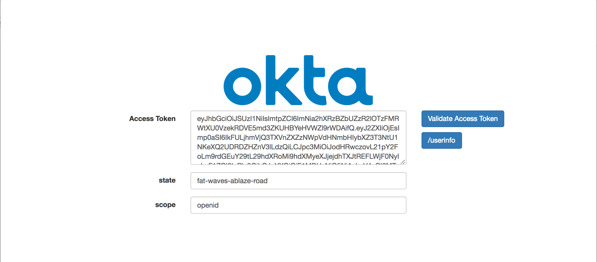
    
4. Copy the `Access Token`
5. From the command line, execute the following (uses [HTTPie](https://httpie.org)):

    ```
    http POST \
    https://okta-oauth-zork.herokuapp.com/v1/game \
    Authorization:"Bearer <access token>"
    ```  

6. You'll see a response like this:

    ```
    {
        "gameInfo": [
            "ZORK I: The Great Underground Empire",
            "Copyright (c) 1981, 1982, 1983 Infocom, Inc. All rights reserved.",
            "ZORK is a registered trademark of Infocom, Inc.",
            "Revision 88 / Serial number 840726"
        ],
        "look": [
            "",
            "West of House",
            "You are standing in an open field west of a white house, with a boarded front door.",
            "There is a small mailbox here."
        ],
        "status": "SUCCESS"
    }
    ```
    
7. You can give it commands too. For instance, to `go north`:

    ```
    http POST \
    https://okta-oauth-zork.herokuapp.com/v1/game \
    Authorization:"Bearer <access token>" \
    command="go north"
    ```
    
    ```
    {
        "gameInfo": [
            "ZORK I: The Great Underground Empire",
            "Copyright (c) 1981, 1982, 1983 Infocom, Inc. All rights reserved.",
            "ZORK is a registered trademark of Infocom, Inc.",
            "Revision 88 / Serial number 840726"
        ],
        "look": [
            "",
            "West of House",
            "You are standing in an open field west of a white house, with a boarded front door.",
            "There is a small mailbox here."
        ],
        "request": "go north",
        "response": [
            "North of House",
            "You are facing the north side of a white house. There is no door here, and all the windows are boarded up. To the north a narrow path winds through the trees."
        ],
        "status": "SUCCESS"
    }
    ```    
    
    
## Zork It Up

You can easily deploy this app and connect it to your own Okta tenant.

### Setup Okta

1. Setup a free Okta developer instance at [https://developer.okta.com](https://developer.okta.com)
2. Add a new application

    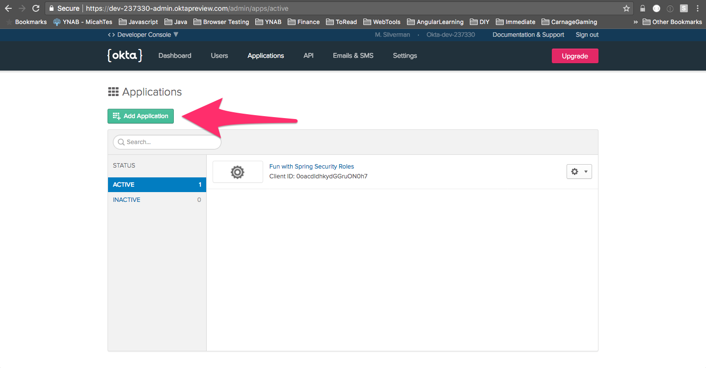
    
    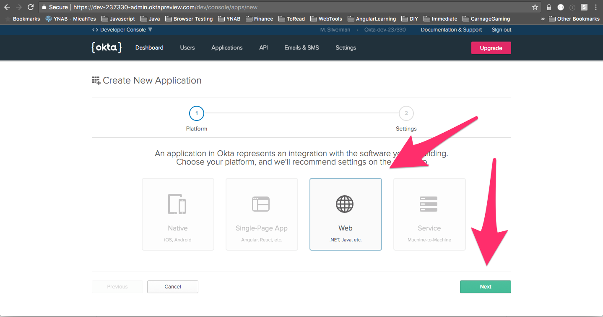
    
    Later, you'll be deploying the Zork application to Heroku. Fill in the values for `Base-URIs` and
    `Login redirect URIs` that match your Heroku app name. That is, if you name your Heroku app:
    `okta-zork-test`, the url will be: `https://okta-zork-test.herokuapp.com`

    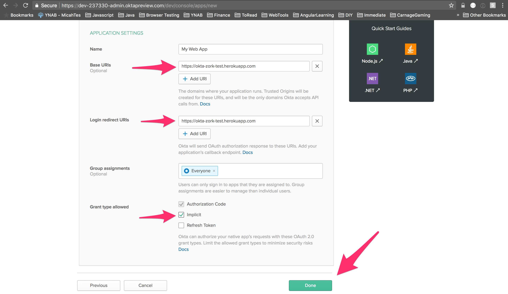
    
    Make note of the Client ID for configuring the app below:
    
    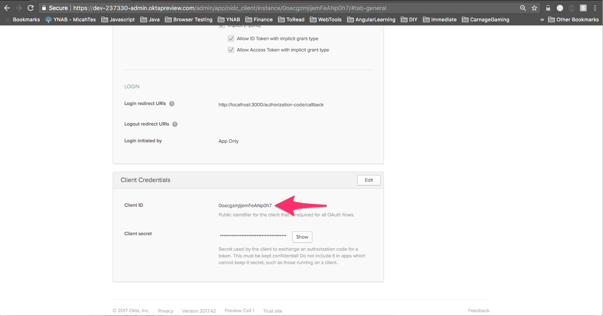
    
3. Update Profile Schema

    The Zork game data, including your progress in the game, is saved to the User Profile. You need to add a custom
    Profile Schema attribute for this.
    
    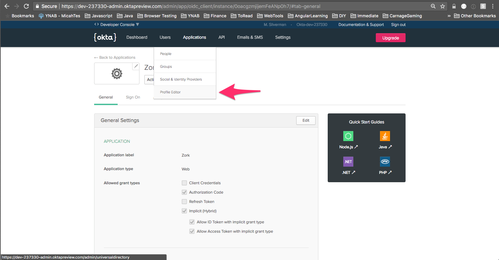
    
    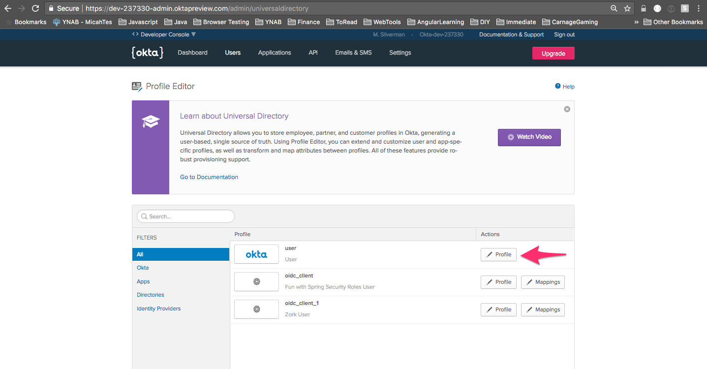
    
    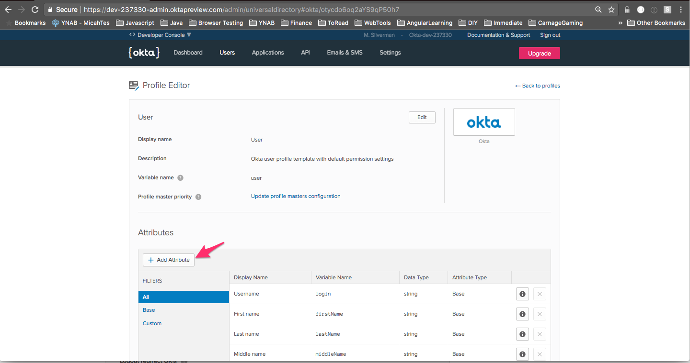
    
    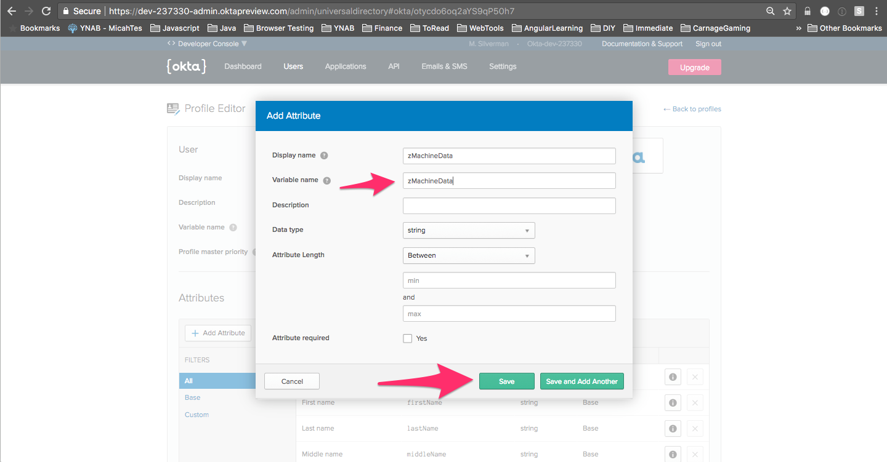
    
4. Create an API Token

    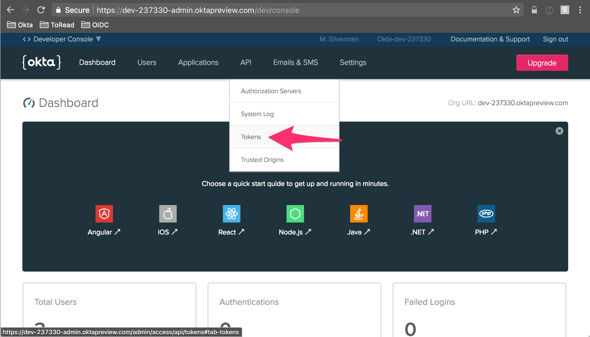
    
    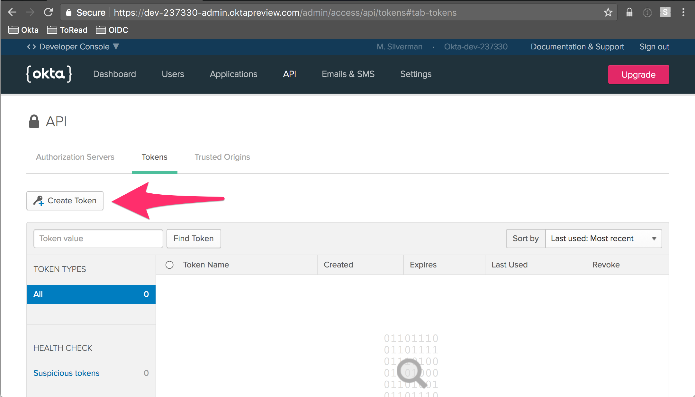
    
    
    
    Make sure to save the token value somewhere as you'll need it below and it's only shown once:
    
    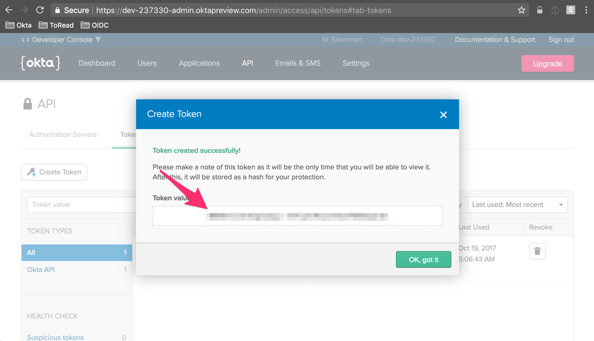
    
    
### Deploy Zork App To Heroku

You can deploy this application to Heroku using the friendly purple button below:

[](https://heroku.com/deploy)

You'll need some information to properly configure the app:

| Environment Variable | Example                |
|----------------------|------------------------|
| OKTA_ORG_URL         | https://micah.okta.com |
| OKTA_API_TOKEN       | see screenshot above   |
| OKTA_CLIENT_ID       | see screenshot above   |
| OKTA_AUDIENCE        | api://default          |
| OKTA_AUTH_SERVER_ID  | default                |

### Cross Origin Resource Sharing (CORS)

You can set a list external base urls (origins) that are allowed to access the `/v1/game` endpoint. This is useful in 
demonstrating a site that makes an ajax call and passes in a valid access token. 
The [OIDC Playground](https://okta-oidc-fun.herokuapp.com) does just that. Its source can be found
[here](https://github.com/oktadeveloper/okta-oidc-flows-example).

Set the `CORS_ALLOWED_ORIGINS` config property with a comma separated list of base urls in heroku to allow external 
access.

### Take Okta Zork For A Spin

Now that you have your own Okta tenant setup and configured and the app is deployed, it's time to see it in action!

1. Browse to your heroku app. For instance: `https://okta-oauth-zork.herokuapp.com`

    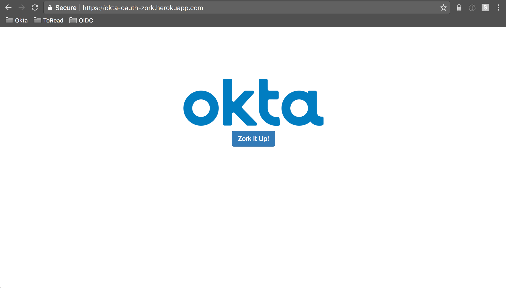
    
2. When you click `Zork It Up!`, you'll be redirected to the login page

    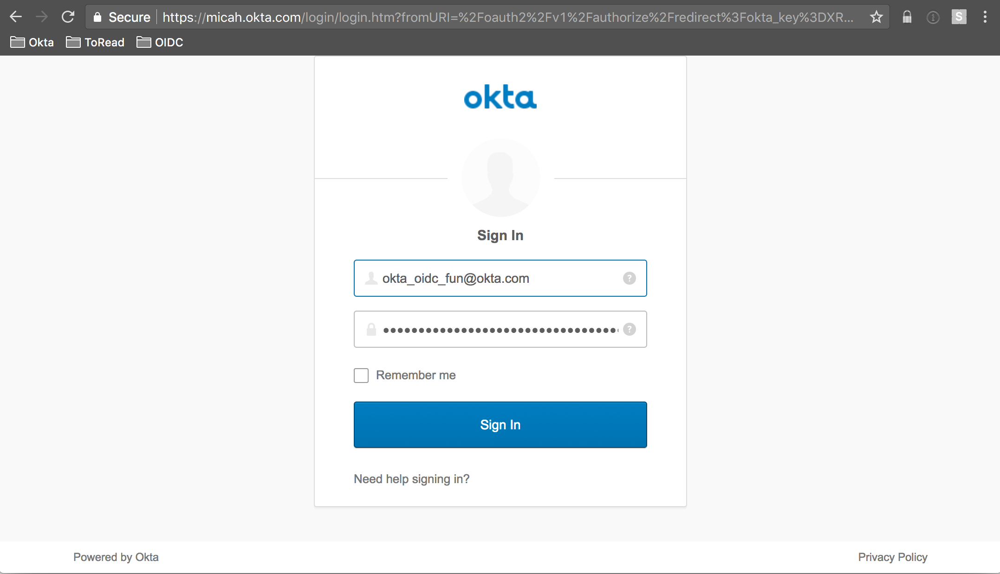
    
3. Once you've logged in, you'll see an access token and a command to interact with Zork

    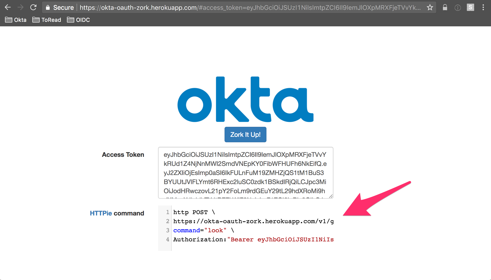 

4. Execute the command with [HTTPie]() (a modern curl replacement)

    

## Learn More

Curious about what's going on here? Dive into our `OIDC Primer` series:

* [Identity, Claims, & Tokens – An OpenID Connect Primer, Part 1](https://developer.okta.com/blog/2017/07/25/oidc-primer-part-1)
* [OIDC in Action – An OpenID Connect Primer, Part 2](https://developer.okta.com/blog/2017/07/25/oidc-primer-part-2)
* [What’s in a Token? – An OpenID Connect Primer, Part 3](https://developer.okta.com/blog/2017/08/01/oidc-primer-part-3)
